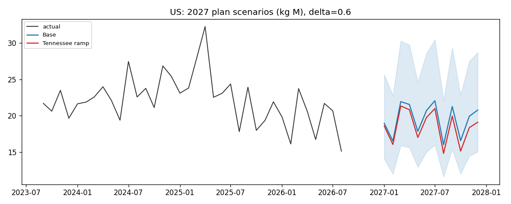
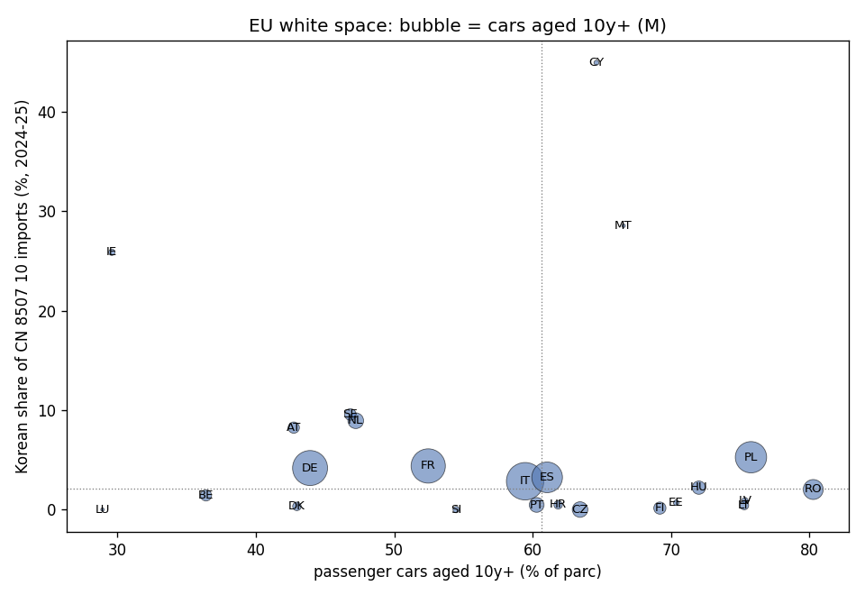
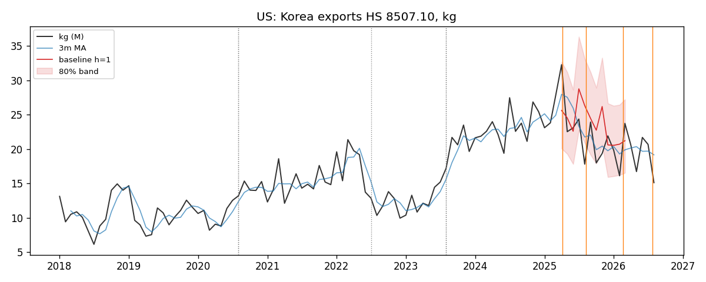

# LAB Export Market Signal — 납축전지 수출 시장 신호 모니터

**공개 무역통계만으로 만든 해외영업용 시장 신호 4개와 2027 시나리오 계획 초안**
HS 8507.10 (피스톤 엔진 시동용 납축전지) · 한국 수출 188개국 · 미국 수입 66개 원산지 · 2018.01–2026.08

> **Independent Project** (2026.10). 한국앤컴퍼니 ES사업본부 해외영업 지원을 계기로 설계·구현.
> 이 저장소의 모든 숫자는 **산업 합산 공개 통계**(관세청·USITC·World Bank·한국은행)에서 나온 것이며 특정 기업의 실적이 아닙니다. "국가"는 거래선 집합의 프록시입니다.

---

 

**대시보드:** _(Streamlit Community Cloud URL — 배포 후 기입)_ · **시장별 브리프:** `docs/briefs/` · **매월 20일 자동 갱신** (GitHub Actions)

## 왜 만들었나

해외영업의 판매계획은 거래선 오더와 재고에서 나오지만, 그 계획이 **어느 시장 환경 위에 놓여 있는지**는 바깥 데이터로만 볼 수 있습니다. 이 프로젝트는 영업 담당자가 거래선 미팅과 연간 계획에 들고 갈 수 있는 신호를 공개 통계로 한 바퀴 돌려본 것입니다.

- 모델은 뒤에, 거래선 앞에서 쓸 숫자는 앞에
- 가설·이벤트·평가 규칙을 **데이터를 보기 전에 고정** (`docs/decision_log.md`, 커밋 이력으로 확인 가능)
- 실패한 가설도 같은 비중으로 보고

---

## 신호 4개 — 요약

### S1. 납값은 어느 시장에서 가격에 빨리 반영되는가 (가격 관리)

납 가격(LME, World Bank Pink Sheet) 변동이 국가별 수출 단가(USD/kg)에 반영되는 속도를 분포 지연 회귀로 추정.

| 시장 | 3개월 누적 전가율 | 6개월 누적 전가율 | 피크 지연 |
|---|---|---|---|
| **영국** | **0.87** (p<0.001) | 0.81 | 3개월 |
| 호주 | 0.27 (p<0.001) | 0.44 | 3개월 |
| 캐나다 | 0.26 (p=0.002) | 0.56 | 5개월 |
| 미국 | 0.21 (p=0.010) | 0.43 | 2개월 |
| 일본 | 0.17 (n.s.) | 0.53 | 6개월 |

상위 15개 시장으로 넓히면 3개월 전가율 순위는 **영국 0.87 → 독일 0.49 → UAE 0.42 → 리비아 0.37 → 사우디 0.36** … **칠레 0.06**. 유럽·중동이 빠르고 미국·일본·동남아가 느린 구조(6개월로는 UAE 0.79, 리비아 0.78이 영국 수준).

**읽는 법.** 영국은 납값 상승의 대부분이 한 분기 안에 단가로 넘어가는 스팟·AM 성격의 시장. 미국·일본은 반 년이 지나도 절반 이하만 반영되는 계약·OE 성격의 시장. 같은 납값 상승이라도 **시장별로 마진이 흡수하는 기간이 다르다** — 거래선 가격 협상에서 시장별 포지션의 근거. 환율 계수는 전 시장 음수(원화 약세 → USD 단가 일부 인하 전가, 일본 -0.76으로 최대).
납값은 수량(kg)에는 유의한 영향이 없음(5개국 중 4개) — 납값은 가격 변수이지 물량 변수가 아님.

### S2. 관세 이후 미국 시장에서 누가 늘고 줄었나 (시장정보)

미국 수입 HTS 8507.10.0060(12V, 6kg 초과 = 자동차용) 원산지별 점유율, 2025.04 상호관세 전후 12개월 비교.

| 원산지 | 사전 점유율 | 사후 점유율 | 변화 | 2026 YTD |
|---|---|---|---|---|
| 멕시코 | 38.0% | 40.6% | +2.6pp | 42.5% |
| **한국** | 28.8% | 30.0% | **+1.3pp** | 27.2% |
| 독일 | 7.4% | 10.5% | **+3.1pp** | 11.3% |
| 베트남 | 8.0% | 4.8% | −3.2pp | 5.6% |
| 중국 | 5.0% | 0.9% | **−4.2pp** | 0.9% |

**읽는 법.** 미국 총수입은 사후 12개월에 **−15%**. 그 안에서 저가 원산지(중국·베트남)가 빠지고 프리미엄(독일)이 늘었으며, 한국산은 점유를 지켰다. 사전 등록 가설("총수입 유지 + 한국산 점유 하락", "최대 수혜 = 멕시코")은 **둘 다 기각** — 실제 그림은 "파이 축소 + 저가 이탈 + 프리미엄 상승"에 가깝다. AGM 프리미엄 포지셔닝 논리와 맞닿는 결과. 2026 YTD에 한국산 점유가 27.2%로 내려오는 것은 미국 현지생산 현지생산 전환과 겹치는 구간이라 S3에서 다룸.

### S3. 2027 시나리오 계획 시트 (판매계획)

채택 기준선을 2027년까지 연장하고, 세 가지 조건부 시나리오로 나눔. 중립 점예측은 만들지 않음 — 파라미터는 `data/scenarios.json`과 대시보드 슬라이더에 전부 노출.

| 시장 | 2025 실적 | 2027 Base | US local production ramp (δ=0.6) | Mix shift (AGM 30%, 1.5×) |
|---|---|---|---|---|
| 미국 | 278M kg / $704M | **234M kg** (−16%) / $577M | **222M kg** (−20%) / $547M | 234M kg / $603M |
| 일본 | 85M | 87M | — | $218M |
| 영국 | 48M | 56M (+17%) | — | $144M |
| 호주 | 62M | 56M | — | $144M |
| 캐나다 | 37M | 34M | — | $85M |
| 합계 | 894M | 828M (−7%) | — | $2,082M |

**읽는 법.** 미국 현지생산 증설 효과를 넣기 전에도 미국향 기준선은 2025 대비 −16% — 2026년의 하락 추세가 그대로 연장된 결과. 증설분 160만대 중 60%가 한국 수출을 대체한다고 가정하면 **2027년에 12M kg(약 58만 개)** 가 추가로 빈다. 이 물량은 영국 2027 기준선의 22%, 캐나다의 36%.

| 재배분 후보 | 최근 12개월 성장 | 2027 Base | 비는 물량 비중 | S1 전가율(3개월) |
|---|---|---|---|---|
| 영국 | +9.4% | 56M | 22% | 0.87 |
| 캐나다 | +13.0% | 34M | 36% | 0.26 |
| 일본 | −3.6% | 87M | 14% | 0.17 |
| 호주 | −3.4% | 56M | 22% | 0.27 |

성장하면서 납값도 빨리 가격에 받아주는 시장은 영국 하나. 이건 결론이 아니라 **2027 계획 회의에서 먼저 물어볼 순서**.

한계: Base는 2026년 하락을 연장한 보수적 기준선. 2027년 밴드는 백테스트 최장 지평(6개월) 분위수를 재사용하므로 과소추정. δ·AGM 비중·프리미엄은 공개 근거가 약한 가정이며 슬라이더로 바꿔볼 것.



### S4. 유럽 white space (신규 시장)

EU 27개국의 CN 8507 10 수입(Comext) × 승용차 보유대수·차령(Eurostat) → 교체 수요가 크고 한국산 점유가 낮은 시장. 가중치 3세트(균형·교체수요·점유여백)로 순위 안정성 확인.

| 순위 | 국가 | 수입 (EUR M, 24–25 평균) | 한국산 | 중국산 | 수입 성장 25/23 | 10년+ 차량 | 10년+ 비중 | AGM 비중 |
|---|---|---|---|---|---|---|---|---|
| 1 | **이탈리아** | 464 | **2.9%** | 4.1% | +16.7% | **24.9M** | 59.5% | 27.5% |
| 2 | 프랑스 | 809 | 4.4% | 3.5% | +7.8% | 20.8M | 52.5% | 12.5% |
| 3 | 독일 | 650 | 4.2% | 4.6% | +4.9% | 21.7M | 43.9% | 15.8% |
| 4 | 스페인 | 418 | 3.2% | 3.3% | +7.5% | 16.7M | 61.1% | 18.9% |
| 5 | 폴란드 | 344 | 5.3% | 5.9% | +2.1% | 17.4M | 75.8% | 11.5% |
| 6 | 체코 | 272 | **0.0%** | 2.0% | +14.6% | 4.3M | 63.4% | 5.7% |
| 7 | 포르투갈 | 99 | **0.5%** | 0.8% | +25.9% | 3.9M | 60.3% | 30.0% |
| 9 | 루마니아 | 109 | 2.0% | 2.7% | +5.8% | 7.0M | 80.3% | 13.9% |

**읽는 법.** 유럽 빅5 전부 한국산 점유가 한 자릿수 초반 — 회사가 말하는 "유럽 8.2%"의 여백이 어디에 있는지가 국가 단위로 보임. 이탈리아는 세 가중치에서 모두 1위: EU 최대 노후 차량, 최저 점유, 두 자릿수 성장, AGM 전환 진행 중. 체코·포르투갈은 규모는 작지만 한국산이 사실상 없는 시장. 반대로 그리스(23.6%)·키프로스(45%)·아일랜드(26%)는 이미 점유가 높아 white space가 아님.
EU 쪽 보너스: CN 8단위가 액체 전해질(8507 10 20)과 기타(8507 10 80 ≈ AGM·겔)로 나뉘어 **AGM 비중**이 시장별로 보임 — 한국·미국 통계에는 없는 정보. 오스트리아 55%, 스웨덴 45%, 이탈리아 27.5%.



---

## 백본 — 기준선·밴드·변화점

| | |
|---|---|
| 대상 | 상위 5개 수출국(미국 29%, 일본 9%, 호주 7%, 영국 5%, 캐나다 4%) + 합계, 월별 kg |
| 모델 | 계절 naive / STL+ETS / SARIMA / **Chronos-2 zero-shot** (파운데이션 모델, 같은 백테스트로 비교) |
| 구간 | 롤링 conformal (이전 폴드 잔차의 경험 분위수 → 80/95%) |
| 백테스트 | 롤링 오리진 12회, h=1·3·6, MASE·coverage |
| 채택 | h1~3 MASE 최소, 80% coverage ∈ [0.70, 0.90] |

| 시장 | 계절 naive | STL+ETS | SARIMA | **Chronos-2** | 채택 |
|---|---|---|---|---|---|
| 미국 | 1.06 | 0.87 | 0.89 | 0.82 (cov 0.64) | STL+ETS |
| 일본 | 0.70 | 0.74 | 0.76 | **0.49** (cov 0.94) | STL+ETS |
| 호주 | 0.80 | 0.77 | 0.89 | 0.91 | STL+ETS |
| 영국 | 1.24 | 1.28 | 0.90 | **0.82** (cov 0.78) | **Chronos-2** |
| 캐나다 | 1.19 | 1.26 | 1.10 | **0.77** (cov 0.92) | SARIMA |
| 합계 | 1.04 | 0.93 | 0.92 | 0.85 (cov 0.61) | 계절 naive |

MASE(h=1~3 평균). **Chronos-2가 6개 중 5개에서 STL+ETS보다 정확**(H6 지지). 그런데 채택은 영국 하나 — conformal 밴드 coverage가 규칙 밖(캐나다·일본 과잉, 미국·합계 부족). 정확도는 파운데이션 모델, 구간 보정은 통계 모델이 나았다는 결과. 상한을 0.95로 풀면 캐나다·일본도 Chronos 채택(사후 탐색 E3).
합계는 충격 구간에서 **계절 naive가 채택** — 모델이 naive를 못 이기면 그대로 보고.

변화점(PELT, STL 계절조정): 미국은 2020-08·2022-07·2023-08. **2025-04 관세 시점에는 단절 없음**. 합계에서는 2025-10에 레벨 하락.



## 사전 등록 가설 판정

| ID | 가설 | 판정 |
|---|---|---|
| H1 | 미국향 수량에 2025-04 ± 2개월 변화점 | **기각** — 단절 아닌 완만한 하락, 합계는 2025-10 |
| H2 | 총수입 유지 + 한국산 점유 하락 | **기각** — 총수입 −15%, 한국산 +1.3pp |
| H3 | 최대 수혜 원산지 = 멕시코 | **기각** — 독일 +3.1pp |
| H4 | 납값 전가율이 시장별로 다름 | **지지** — 스프레드 70pp, 5개 중 4개 유의 |
| H5 | 납값은 가격에만, 물량에는 아님 | **지지** — 4/5 |
| H6 | Chronos-2 > STL+ETS (h1~3 MASE) | **지지** — 6개 중 5개 |

S3·S4는 시나리오·스코어링이라 가설 판정 대상이 아님.

가설 원문·판정 규칙·사후 탐색 구분은 `docs/decision_log.md`.

---

## 사후 탐색 (사전 등록 아님) — `docs/exploratory.md`

- **E1 추세 꺾임.** 미국향 기울기는 2023-08부터 −4%/yr로 한 구간 — **2025년에 꺾임이 없다.** 하락은 관세보다 20개월 먼저, 미국 현지생산 현지생산(140만대) 가동과 겹치는 시점에 시작됐다. 합계도 2023-10부터 −4%. 관세는 추세를 만들지 않았고, 이미 진행 중이던 현지생산 전환 위에 얹혔다.
- **E2 선적 당김.** 2025.03~05 초과 선적 +10.2M kg(평균 월 물량의 0.43개월), 2025.06~09 되갚음 −12.4M kg(0.53개월). 첫 반 년 안에서는 **시기 이동이지 수요 이동이 아님.**
- **E3 coverage 완화.** 상한 0.95로 풀면 캐나다·일본이 Chronos-2 채택. 영국은 엄격 규칙에서도 Chronos.

## 시장별 브리프 — `docs/briefs/`

parquet만 읽어서 시장당 1장을 자동 생성(`python -m core_pipeline.brief`, 대시보드 다운로드 버튼). 물량(기준선 대비 갭·밴드 이탈 월·변화점), 가격(전가율·환율·단가 추이), 경쟁(미국: 원산지), 2027 시나리오, **거래선에 물어볼 질문 3개** — 질문은 숫자 조건에 따라 바뀐다(전가율 높으면 납값 조항 반영 주기, 밴드 이탈 있으면 그 달의 재고/수요, 성장 시장이면 재배분 여력).

## 자동 갱신과 테스트

- `monthly-refresh` (GitHub Actions, 매월 20일): 관세청·납값·환율·Comext·차령 재수집 → 5개 스테이지 + Chronos-2 재실행 → parquet·그림·브리프 봇 커밋 → 대시보드 자동 반영. USITC는 공개 API가 없어 수동 갱신.
- `ci` (push마다): pytest 8개 — 모델 출력 형태, MASE 분모, conformal 밴드 정합성, PELT가 주입한 레벨 시프트를 ±2개월 안에 잡는지, ramp 선형성, 믹스 계수, events.json 스키마.
- 2027 기준선은 로컬에서 채택 모델(영국은 Chronos-2)로 적합해 `base_forecast_2027.parquet`에 저장; 대시보드는 그 위에서 시나리오 산술만 수행(torch 불필요).

## Evidence Levels

- **Observed** — 관세청·USITC 원자료에서 직접 계산한 수치. 두 소스 교차검증: 미국향 kg(관세청) vs 한국산 개수(USITC) 상관 0.895(1개월 lag), 개당 21kg.
- **Inferred** — 회귀 추정치(S1), 변화점, 백테스트 성적. 모델 가정에 의존.
- **Proposed** — 2027 시나리오(S3), white space 스코어(S4). 파라미터 선택에 의존, 결론이 아니라 질문 목록.

## 한계

- 산업 합산: 한국 수출 = 복수 제조사 합계. 특정 기업의 판매 아님.
- 관세청 수출은 **중량(kg)·금액**만 제공 → 단가는 USD/kg이며 제품 믹스(사이즈·AGM 비중)가 섞임. HSK 10단위에 AGM 세분 없음.
- 국가 간 통계 불일치는 수준이 아니라 추세·점유율로만 비교.
- 2025-04 관세 메커니즘은 IEEPA 상호관세(10% → 8월 15% → 2026.02 무효)로 정리. 232조 자동차부품 목록에 8507.10 미포함은 2차 소스 기준(Annex I 원문 미확인).
- 원산지별 단가(USITC)는 일본·베트남 등 일부 원산지에서 믹스 왜곡이 커서 비교에 쓰지 않음.

---

## 데이터

| 소스 | 내용 | 접근 |
|---|---|---|
| 관세청 품목별 국가별 수출입실적 (data.go.kr 15100475) | 한국 수출, HSK 10단위, 국가·월별 kg·USD | API |
| USITC DataWeb | 미국 수입 HTS 8507.10 10단위, 원산지·월별 value·units | 다운로드 |
| World Bank Pink Sheet | 납 월평균 가격 | 다운로드 |
| 한국은행 ECOS 731Y004 | 원/달러 월평균 | API |
| Eurostat Comext DS-045409 | EU 27개국 수입 CN 8507 10 20/80, 원산지 KR·CN·World, 월별 EUR·개수 | API |
| Eurostat road_eqs_carage | 회원국별 승용차 연령대별 보유대수 | API |

## 실행

```
pip install -r requirements.txt
cp .env.example .env            # DATA_GO_KR_KEY, ECOS_API_KEY
python -m core_pipeline.ingest_kcs --pull
python -m core_pipeline.ingest_usitc
python -m core_pipeline.ingest_lead
python -m core_pipeline.ingest_fx
python -m scripts.run_stage0
python -m scripts.run_stage1 --with-chronos
python -m scripts.run_stage2
python -m scripts.run_stage3
python -m core_pipeline.ingest_comext && python -m core_pipeline.ingest_parc
python -m scripts.run_stage4
python -m core_pipeline.brief
python -m scripts.run_exploratory
python -m pytest -q
streamlit run app/streamlit_app.py
```

## 구조

```
core_pipeline/   ingest_*.py, series.py, baseline_models.py, backtest.py,
                 changepoint.py, pass_through.py, origin_shift.py, scenarios.py, white_space.py, brief.py
scripts/         run_stage0.py … run_stage4.py, run_exploratory.py, refresh.sh
app/             streamlit_app.py (시장 신호 / 2027 시트 2탭)
data/            events.json (사전 등록 이벤트), scenarios.json, processed/*.parquet
docs/            decision_log.md, methodology.md, exploratory.md, briefs/, figs/
tests/           test_core.py
.github/         ci.yml, monthly_refresh.yml
```
